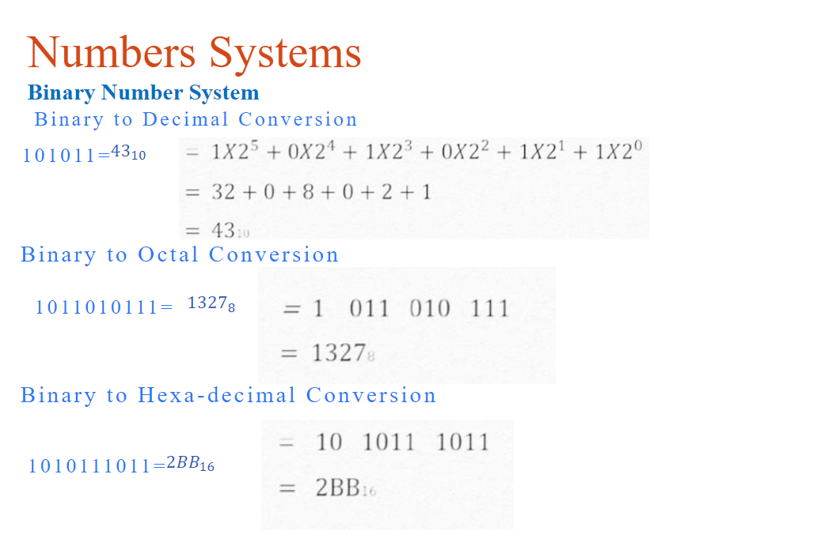
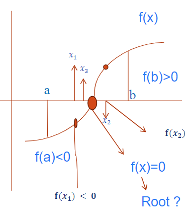

# NumericalAnalysis

## 03/07  

[PDF](./Numerical%20analysis(week1,%20Lecture-1).pdf)

You are familiar with the decimal Number system:

$$ 312.45= 3×10^2 +1×10^1+ 2×10^0+ 4×10^−1+ 5×10^−2 $$

2진수변환 과정  

Implicit Normalization
$$ (5.625)10→(101.101)2 $$
$$ (101.101)2→1.01101 ×2^2 $$
$$ S=0 $$
$$ Exponent=2 +8=10 (1010)2 $$
$$ Mantissa=01101 $$
$$ S (1bit) E(4 bits) M (5 bits) $$
$$ 0 1010 01101 $$

Non-normalized form: Find the binary equivalent of  the given 
number by the conventional method.

Single Precision
단일 정밀도

부동 소수점을 표현 하는 방법

Floating point representation 

Step 1: single precision real number representation
1단계: 단일 정밀 실수 표현현

➢ Non-normalized form: Find the binary equivalent of  the given number by the conventional method. 
비 정규화 딘 형태: 기존 방법별로 주어진 숫자와 동등한 이진을 찾기

$$ 11001.11 $$

Step 2: represent it in formalized form
그것을 공식호 된 형태로 표현

$$ 1.100111𝑋2^4 $$

Step 3: remove the first number and add zeros to the right hand side to get the full 
mantissa part until it becomes in 24 bits (3bytes form)

첫 번째 숫자를 제거하고 오른쪽에 0을 추가하여 전체를 얻으십시오.  
Mantissa는 24 비트가 될 때까지 부품 (3 비트 형태)

$$ 100 1110 0000 0000 0000 0000 $$

Step 4: find biased exponent part (add 127 with the exponent and find the binary 
equivalent in 8 bits (1) form)

4 단계 : 바이어스 지수 부분을 찾으십시오 (지수로 127을 추가하고 바이너리를 찾으십시오. 8 비트 (1) 양식)

## 03/09

2진수 10진수로 변환 식

$$ (10101)_{2} = (?)_{10} $$  
$$ 1 * 2^4 + 0 * 2^3 + 1 * 2^2 + 0 * 2^1 + 1 * 2^0$$  
$$ (21)_{10} $$

2진수 8진수 변환 식

$$ (10101)_{2} = (?)_{8} $$
$$ (25)_{8}$$

2진수 16진수 변환 식

$$ (10101)_{2} = (?)_{16} $$
$$ (F)_{16} $$

### 8진수 변환

8진수 변환 시 왼쪽부터 3bit씩 묶어서 진수 변환  

$$ ex) 10 | 101 => 2(1 * 2^1 + 0 * 2^0) |5(1 * 2^2 + 0 * 2^1 + 1* 2^0) $$

역도 가능  

$$ ex) 2 | 5 => 10 | 101$$

### 16진수 변환

16진수 변환 시 4bit씩 묶어서 변환  

$$ 10AF_{16} = 0001000010101111_{2} $$
$$ 1 0 A F $$
$$ 0001 0000 1010 1111 $$
$$ 0001000010101111 $$

4Bit

### 진수 변환

10진수에서 16진수, 8진수, 2진수로 변환하기 위해선 해당 진수로 값을 나누고 나머지를 아래에서 위로 나열하면 해당 진수가 나온다.

### Round-off errors

실수 소실 문제(올림/내림)

$$ 0.2349 => 0.234 $$

### Path Finding  

Find the root of 

$$ 𝑭(𝒙)=𝒙^𝟑 −𝟒𝒙−𝟗 $$
$$ 𝐹(0)=(0)3−4(0)−9 = −9 $$
$$ 𝐹(1)=(1)3−4(1)−9 = −12 $$
$$ 𝐹(2)=(2)3−4(2)−9 = −9 $$
$$ 𝐹(3)=(3)3−4(3)−9 = 6 $$

2와 3에서 음수에서 양수로 변하기 때문에 root가 2와 3사이에 있음을 유추할 수 있다..

따라서 다음과 같은 식을 세울 수 있다

$$ 𝑥_1 = {𝑎+𝑏\over2} = {2+3\over2} = 2.5$$

다시 `x1`을 함수에 넣어 계산해보면 `-3.375`가 계산되고

아직 root가 아니기 때문에 2.5와 3의 사이로 다시 위의 식을 반복한다.  

$$ 𝐹(2.5) = -3.375 $$
$$ 𝐹(3)=(3)3−4(3)−9 = 6 $$

$$ x_2 = {x_1 + b\over2} = {2.5+3\over2} = 2.75 $$

또 다시 `x2`을 함수에 넣어 계산하면 `0.79`가 계산된다.

다시 2.5와 2.75의 사이 값을 계산한다. 

이렇게 무한대로 타고 들어가면 

Hence the root is 2.7065 and correct upto four decimal place

2.7065라는 근사값이 나온다.

#### Closed Loop

#### Open Loop

