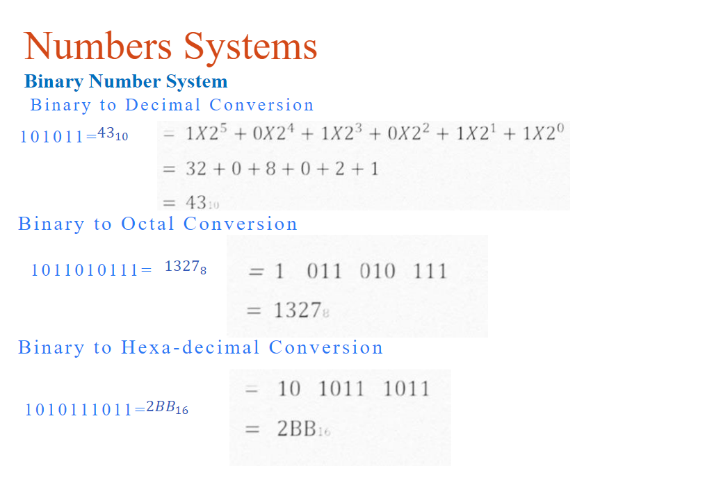

# NumericalAnalysis

## 03/07  

[PDF](./Numerical%20analysis(week1,%20Lecture-1).pdf)

You are familiar with the decimal Number system:

$$ 312.45= 3×10^2 +1×10^1+ 2×10^0+ 4×10^−1+ 5×10^−2 $$

2진수변환 과정  

Implicit Normalization
$$ (5.625)10→(101.101)2 $$
$$ (101.101)2→1.01101 ×2^2 $$
$$ S=0 $$
$$ Exponent=2 +8=10 (1010)2 $$
$$ Mantissa=01101 $$
$$ S (1bit) E(4 bits) M (5 bits) $$
$$ 0 1010 01101 $$

Non-normalized form: Find the binary equivalent of  the given 
number by the conventional method.

Single Precision
단일 정밀도

부동 소수점을 표현 하는 방법

Floating point representation 

Step 1: single precision real number representation
1단계: 단일 정밀 실수 표현현

➢ Non-normalized form: Find the binary equivalent of  the given number by the conventional method. 
비 정규화 딘 형태: 기존 방법별로 주어진 숫자와 동등한 이진을 찾기

$$ 11001.11 $$

Step 2: represent it in formalized form
그것을 공식호 된 형태로 표현

$$ 1.100111𝑋2^4 $$

Step 3: remove the first number and add zeros to the right hand side to get the full 
mantissa part until it becomes in 24 bits (3bytes form)

첫 번째 숫자를 제거하고 오른쪽에 0을 추가하여 전체를 얻으십시오.  
Mantissa는 24 비트가 될 때까지 부품 (3 비트 형태)

$$ 100 1110 0000 0000 0000 0000 $$

Step 4: find biased exponent part (add 127 with the exponent and find the binary 
equivalent in 8 bits (1) form)

4 단계 : 바이어스 지수 부분을 찾으십시오 (지수로 127을 추가하고 바이너리를 찾으십시오. 8 비트 (1) 양식)

